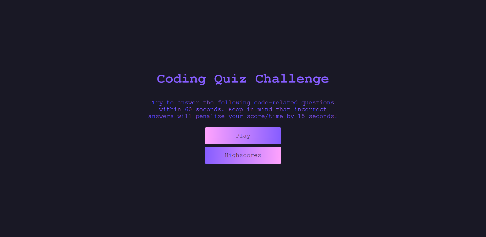
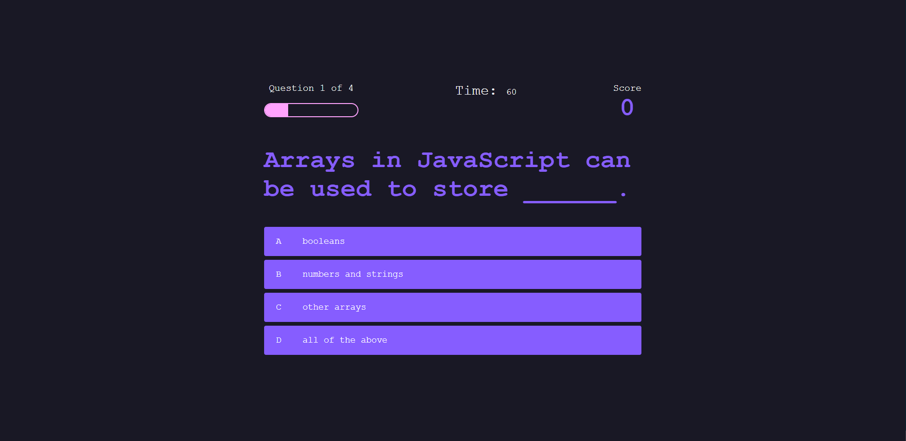
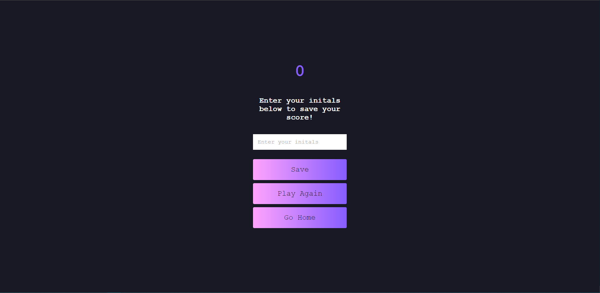
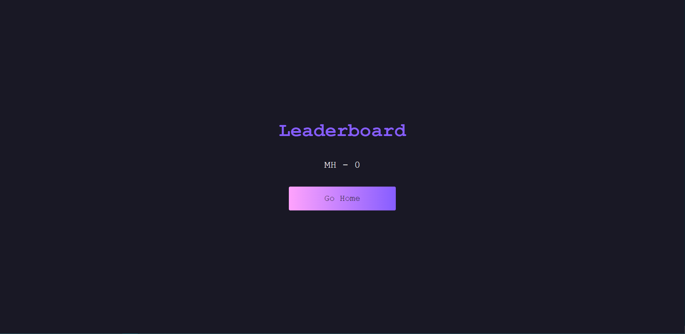

# Homework-4-codequiz

https://seafoodude.github.io/GIT-quizzed-NUB/

## Description

This Homework 4 Codequiz was created for boot camp students who were going through Module 04. It contains a short 60 second 4 question quiz regarding code functions.

My motivation came from my desire to learn Javascript, HTML, and CSS and apply it in creating a small codequiz.
I created this codequiz to show that I have learned and absorbed the information given to me through the Module 04 requirement from the UCLA coding bootcamp.
This helped me to achieve a foothold in building more complex and functional programs in my future projects.
I learned how to build a quiz to display my knowledge and understanding of Javascript, HTML, and CSS.

## Table of Contents 

- [Installation](#installation)
- [Usage](#usage)
- [Credits](#credits)
- [License](#license)

## Installation

N/A

## Usage

To use this Homework 4 Codequiz, first read the description. Click on Play to start the quiz. It will prompt a series of multiple choice questions, of which you have 60 seconds to answer. Each correct answer (blue) will add 100 points to your score. Each incorrect answer (red) will deduct 15 seconds from the remainder of the time. Once the timer reaches 0, or you finish all 4 questions, you will be taken to the end page where you can save your score to a leaderboard. Once saved, you can click on Highscores to see the top 5 scores.

**SCREENSHOTS**

## Credits

N/A

## License

Please refer to the LICENSE in the repo.
